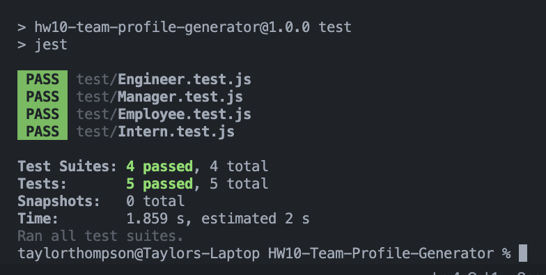

# 10 Object-Oriented Programming: Team Profile Generator

## Description
This is a Node.js command-line application that takes in information about employees on a software engineering team, then generates an HTML webpage that displays summaries for each person.  

AS A manager 
I WANT to generate a webpage that displays my team's basic info  
SO THAT I have quick access to their emails and GitHub profiles  

## Table of Contents

- [Installation](#installation)
- [Usage](#usage)
- [Contributing](#contributing)
- [Tests](#tests)
- [Questions](#questions)

## Installation 
My first steps were to create my classes for the Employee, Engineer, Intern, and Manager. Using inquirer, I created the command line questions and created functions to redirect the user as they created their team members. Now that my variables were defined, I was able to create my htmlRenderer.js page. Using the classes already defined I built my card templates into my functions and input my classes into the text line of the document. Then I ran tests using the Jest feature. 

## Usage
 The application will be invoked by using the following command: bash +node index.js. Please see the gif below for my tests and a full walk through or, for larger viewing capabilities please visit my [YouTube Tutorial Video]( https://youtu.be/Fomol2G1jQU).   

## Contributing
 This project would not have been possible without the contributions credited in the links below.  [Team Generator Guide]( https://uwa.bootcampcontent.com/UWA-Bootcamp/uw-blv-virt-fsf-pt-12-2021-u-c/-/tree/master/10-OOP/01-Activities)    [Inquirer Package](https://www.npmjs.com/package/inquirer)

## Tests
 I tested each of my class functions to make sure that each of the roles would be uniquely defined with my getRole() class.  
## Questions
Please feel free to contact me with any questions or suggestions either on my GitHub account or via email.  
* GitHub: https://github.com/taylor25et  
* E-Mail: taylor25et@gmail.com